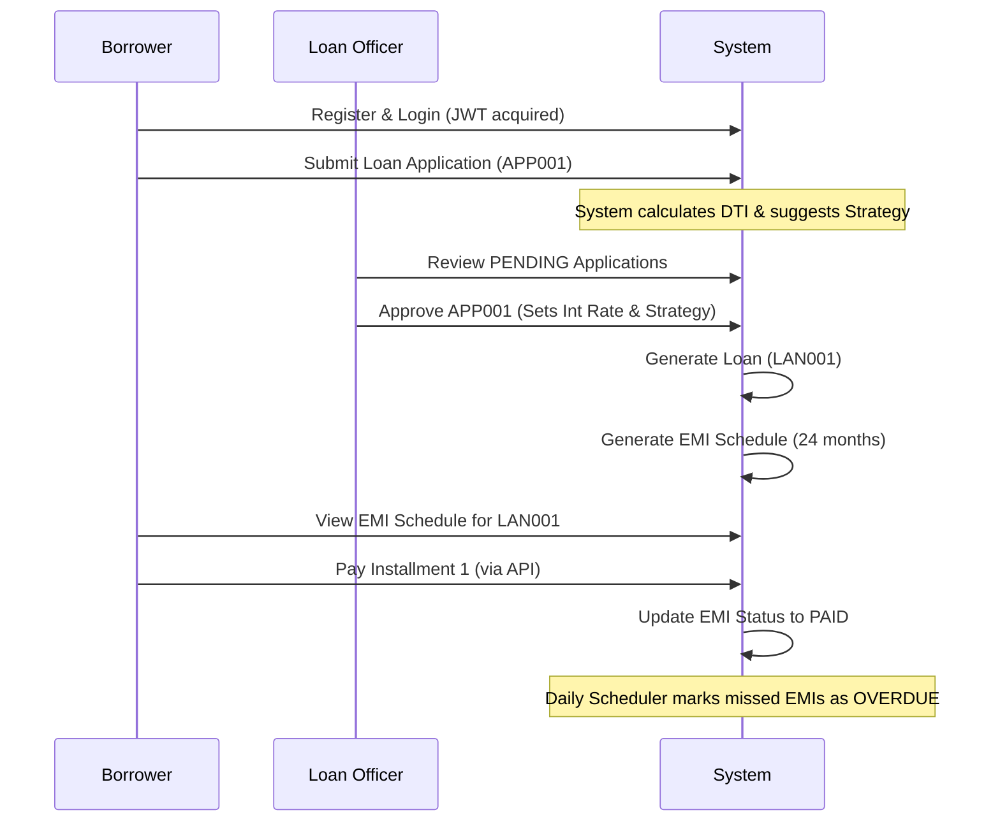

# EMILoan API Documentation

## Overview
This documentation provides complete details of all API endpoints for the **EMILoan** application.

**Base URL**: `http://localhost:8080`

---

## 1. Authentication Endpoints (Public)

### Login
Authenticates a user and returns a JWT token.
- **URL**: `/api/v1/auth/login`
- **Method**: `POST`
- **Request Body**:
  ```json
  {
      "email": "user@example.com",
      "password": "SecurePassword123"
  }
  ```
- **Success Response**: `200 OK`

### Borrower Registration
Registers a new borrower.
- **URL**: `/api/v1/auth/register/borrower`
- **Method**: `POST`
- **Request Body**:
  ```json
  {
      "firstName": "John",
      "lastName": "Doe",
      "email": "john.doe@example.com",
      "password": "SecurePassword123",
      "phone": "9876543210",
      "pan": "ABCDE1234F",
      "monthlyIncome": 50000.0
  }
  ```
- **Success Response**: `201 CREATED`

---

## 2. Profile Management

### Get Borrower Profile (Requires **BORROWER**)
Retrieves specific profile and user details for the logged-in borrower.
- **URL**: `/api/v1/borrower/profile`
- **Method**: `GET`
- **Success Response**: `200 OK`

### Get Employee Profile (Requires **LOAN_OFFICER** or **ADMIN**)
Retrieves profile details for the logged-in employee.
- **URL**: `/api/v1/employee/profile`
- **Method**: `GET`
- **Success Response**: `200 OK`

### Register Loan Officer (Requires **ADMIN**)
Allows an admin to create a new loan officer account.
- **URL**: `/api/v1/employee/admin/register/officer`
- **Method**: `POST`
- **Request Body**:
  ```json
  {
      "firstName": "Officer",
      "lastName": "Two",
      "email": "officer2@loan.com",
      "password": "Password123",
      "phone": "9000800070",
      "pan": "OFFIC5678G",
      "salary": 68000.0,
      "joiningDate": "2024-03-29"
  }
  ```
- **Success Response**: `201 CREATED`

---

## 3. Loan Application Endpoints

### Apply for Loan (Requires **BORROWER**)
Submits a new loan application.
- **URL**: `/api/v1/loan/applications/apply`
- **Method**: `POST`
- **Request Body**:
  ```json
  {
      "requestedAmount": 500000,
      "tenureMonths": 24,
      "existingEmi": 5000
  }
  ```
- **Success Response**: `201 CREATED`

### Get All Applications (Requires **BORROWER** or **LOAN_OFFICER**)
- **URL**: `/api/v1/loan/applications/`
- **Method**: `GET`
- **Query Params**:
  - `pageNumber` (default 0)
  - `pageSize` (default 10)
  - `status` (PENDING, APPROVED, REJECTED)
- **Note**: Borrowers only see their own apps; Officers see all.

### Get Application Details (Requires **BORROWER** or **LOAN_OFFICER**)
- **URL**: `/api/v1/loan/applications/{applicationCode}`
- **Method**: `GET`
- **Success Response**: `200 OK`

---

## 4. Loan Management Endpoints

### Process Application (Requires **LOAN_OFFICER**)
Approve or reject a pending loan application.
- **URL**: `/api/v1/loan/{applicationCode}`
- **Method**: `PUT`
- **Request Body**:
  ```json
  {
      "status": "APPROVED",
      "interestRate": 10.5,
      "officerStrategy": "REDUCING_BALANCE",
      "remarks": "Strong credit history"
  }
  ```
- **Status Options**: `APPROVED`, `REJECTED`
- **Strategy Options**: `FLAT_RATE`, `REDUCING_BALANCE`, `STEP_UP`

### Get EMI Schedule (Requires **BORROWER** or **LOAN_OFFICER**)
Retrieves the full list of installments for a specific loan.
- **URL**: `/api/v1/loan/{loanCode}/schedule`
- **Method**: `GET`
- **Success Response**: `200 OK`

---

## 5. Payment Endpoints

### Make Payment (Requires **BORROWER**)
Pays an EMI installment.
- **URL**: `/api/v1/payment/pay`
- **Method**: `POST`
- **Request Body**:
  ```json
  {
      "emiId": "9b1deb4d-3b7d-4bad-9bdd-2b0d7b3dcb6d",
      "paymentMode": "UPI"
  }
  ```
- **Payment Modes**: `UPI`, `CARD`, `NETBANKING`

### Get My Payments for a Loan (Requires **BORROWER**)
- **URL**: `/api/v1/payment/loan/{loanId}`
- **Method**: `GET`

### Get My Complete Payment History (Requires **BORROWER**)
- **URL**: `/api/v1/payment/`
- **Method**: `GET`

### Get All System Payments (Requires **LOAN_OFFICER**)
- **URL**: `/api/v1/payment/all`
- **Method**: `GET`

---

## 6. Logical Flow & Lifecycle



---

## Default Credentials
- **Admin**: `admin@example.com` / `AdminPassword123`
- **Test Borrower**: `borrower@example.com` / `Password123`
- **Test Loan Officer**: `officer1@loan.com` / `Password123` (Example)
